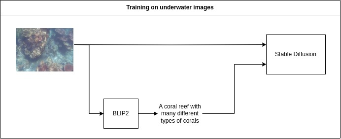
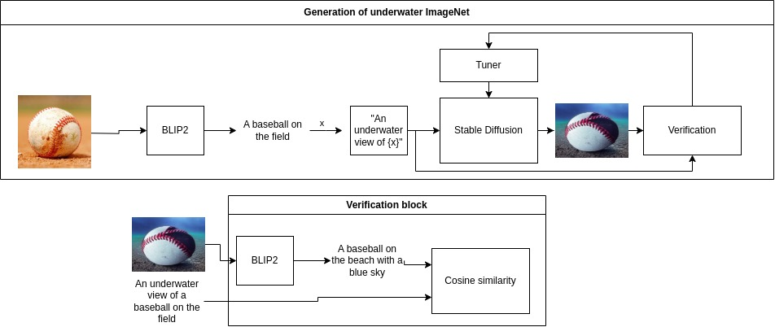
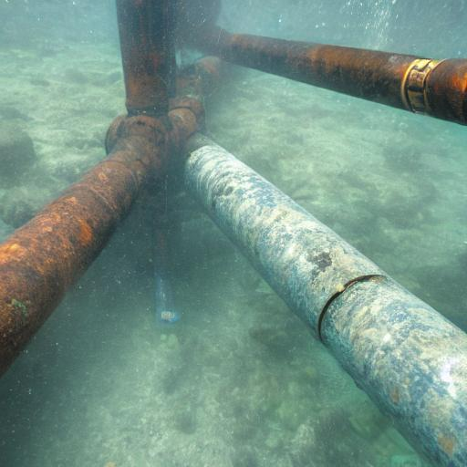

# Underwater image generation
Generating underwater images using **Stable Diffusion**

This work proposes a method for automatically generating millions of underwater images using **Stable Diffusion**.
The steps are as follows:

1. **Training Step**
Train Stable Diffusion on real underwater images and their captions using LoRA. Captions are generated by the state-of-the-art image captioning model, BLIP2.
<p align="center">
  
</p>

2. **Inference Step**
A prompt is fed into the model with a prefix of "An underwater view of". The model generates an underwater image. The verification block check its suitability.
If it is not suitable, the image is regenerated with a different seed.
Verification block consists of BLIP2, which generate a caption of the generated image. Then it compares its cosine similarity with the input prompt.
If the similarity is lower than a threshold, the image is considered unsuitable.

<p align="center">
  
</p>

## Results
An example generated from the prompt: **An underwater view of a pipe**
<p align="center">
  
</p>

## Installation
Two conda environments are required. The reason is the conflict of transformers versions between lavis and diffusers.
**Note:** Later I will use BLIP2 from HuggingFace to not have to install two environments.

```bash
conda create -n blip python=3.11
conda activate blip
pip install salesforce-lavis
conda deactivate

conda create -n underwater python=3.11
conda activate underwater

pip3 install torch torchvision --index-url https://download.pytorch.org/whl/cu118
pip install accelerate
pip install git+https://github.com/huggingface/diffusers
pip install -U sentence-transformers
```

## Training
### Prepare the data
Make sure to store the data in a folder called **train** inside your data folder.
```bash
python generate_underwater_captions.py --data-path underwater_images/train
```
This will generate a csv file called **underwater_captions.csv** inside the **train** folder.

### Train Stable Diffusion with LoRA
```bash
accelerate launch examples/text_to_image/train_text_to_image_lora.py  --train_data_dir underwater_images  --pretrained_model_name_or_path  stable-diffusion-v1-5/stable-diffusion-v1-5 --train_batch_size 1 --checkpointing_steps 1000 --validation_prompt "An underwater view of a metal pipe"
```

## Inference
Put all prompts in a text file.
```bash
python infer_loop.py <prompts_file> blip --sd-model stable-diffusion-v1-5/stable-diffusion-v1-5 --lora-path sd-model-finetuned-lora/checkpoint-6000 --num-images 4 --num-attempts 4 --output-path generated_images
```
